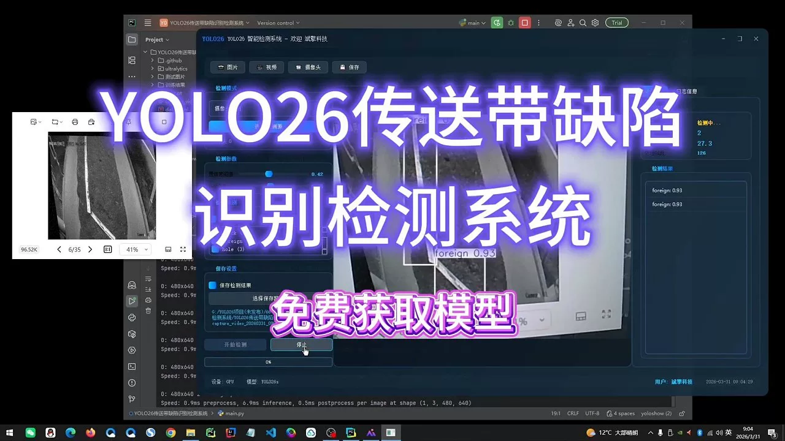
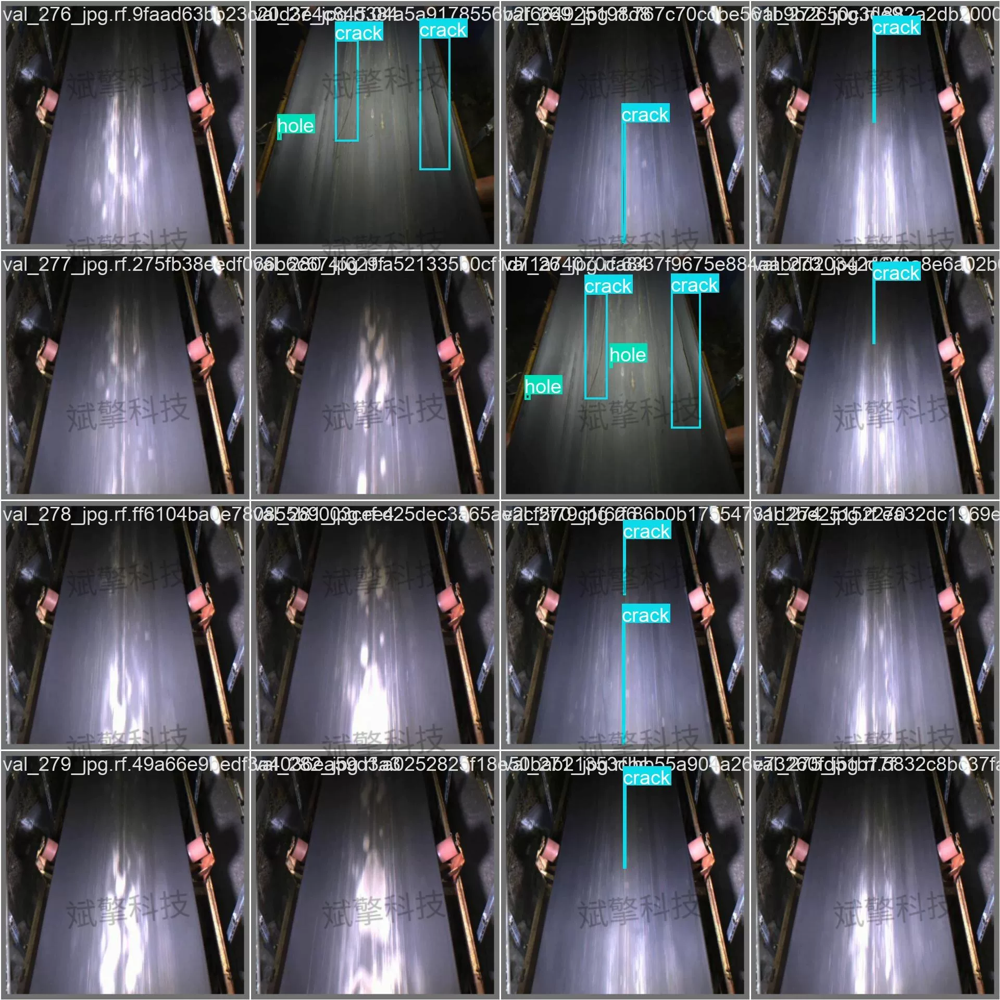
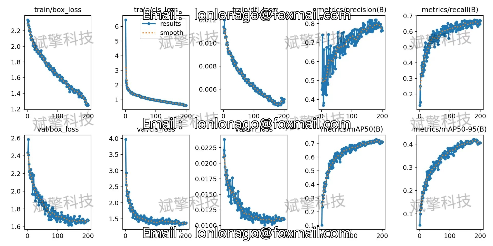
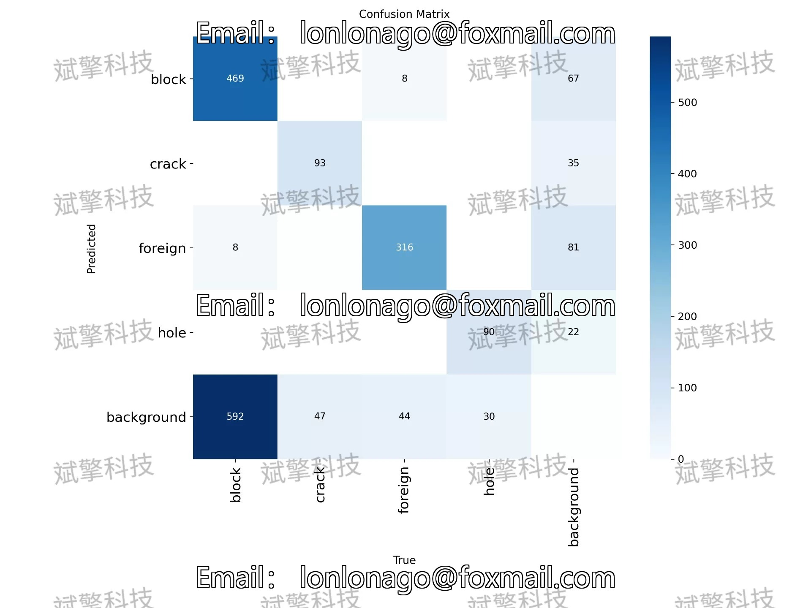
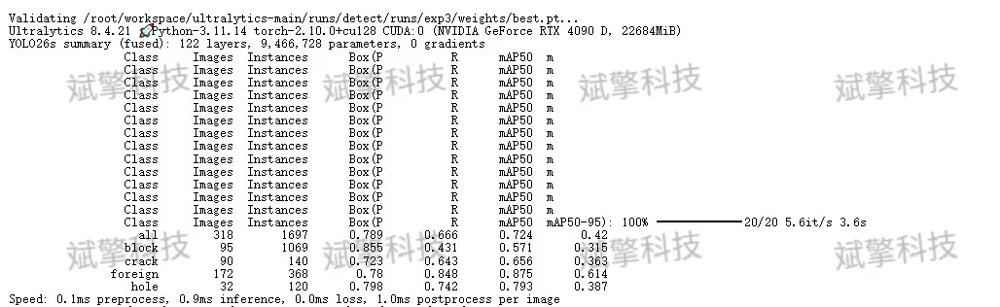
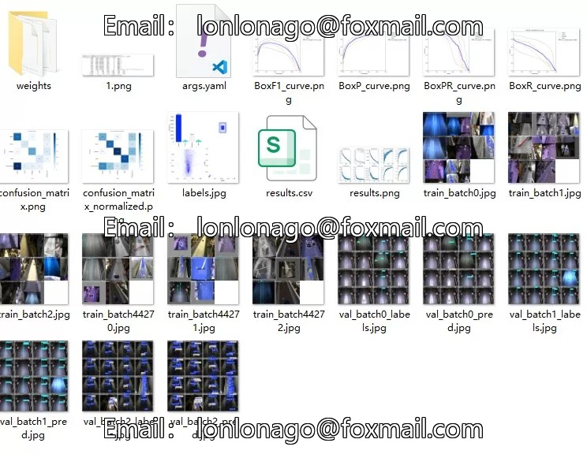
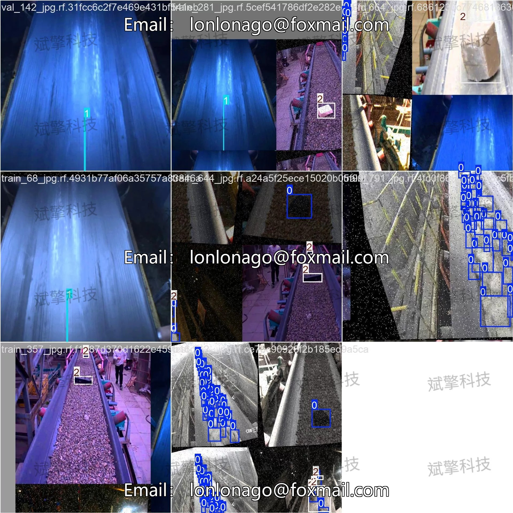
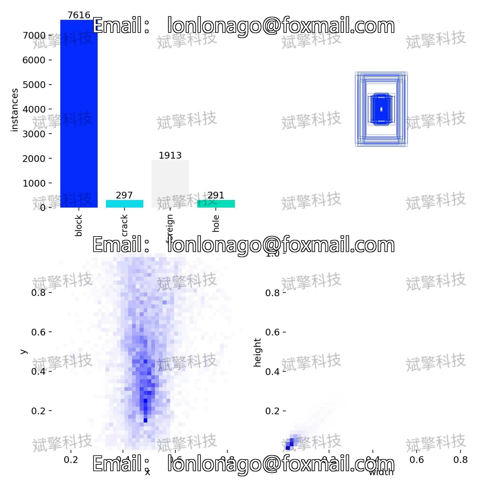

# YOLO26 conveyor belt defect detection system | dataset

## Body

YOLO26 Transfer Belt Defect Detection System | Dataset Based on YOLO26 Deep Learning for Transfer Belt Defect Detection System (Project Source Code + Dataset + Model Weights + UI Interface + Python + Deep Learning + Remote Environment Deployment)

Transfer belts, as key conveyor equipment in industrial production, have significant importance for ensuring production safety and improving operational efficiency through real-time detection of surface defects. Addressing the issues of low efficiency and potential missed detection in traditional manual inspection, this paper constructs a transfer belt defect recognition detection system based on the YOLO26 object detection algorithm, focusing on recognizing four typical defects: block (blockage), crack (crack), foreign (foreign object), and hole (hole). The experimental dataset consists of 2345 images, divided into training set (1860), validation set (318), and test set (167) according to a 7:1.2:0.8 ratio.

The dataset used in this study is a self-built dataset for surface defect images of transfer belts, comprising 2345 images, divided into training set (1860), validation set (318), and test set (167) at a ratio of 7:1.2:0.8. The construction of the dataset fully considers the diversity of actual industrial scenarios, ensuring that the model can learn rich feature representations during training.
The dataset labels four types of typical transfer belt defects:
block    Blockage, material accumulation or mechanical obstruction causing the belt to run obstructed
crack    Crack, linear fracture traces appearing on the surface or edge of the belt
foreign    异物, external objects mixed into the surface of the belt, such as metal, stones, etc.
hole    Holes, penetrating or non-penetrating cavities formed on the surface of the belt

Free reservation for remote installation. Unsuccessful installation will result in a full refund.
Purchase includes the following resources (unlocked in Baidu Cloud):
YOLO identification detection project complete source code
YOLO format dataset
Training code + UI interface code
Trained model + results image
Software installer
Add WeChat to make a reservation for remote installation (automatically displayed WeChat ID after purchase) - Unsuccessful, full refund

⚙️ Core function modules
Detection capability
Image detection: upload and check immediately, returning detection boxes + category information
Video detection: supports video files, analyzing frames accurately
Camera real-time detection: connect an USB camera to achieve dynamic monitoring
Interaction and control
Target filtering: freely select one or more categories for detection
Parameter adjustment: adjustable confidence threshold & IoU threshold, flexibly controlling precision
Result saving: save images/videos/camera detection results in one click
System and data
User login registration: Support password strength detection + encrypted storage
Log recording: automatically records operation and error information (timestamped)

## Images

## Payment

Here is a pay link on Stripe ( https://buy.stripe.com/3cs8yP7sY87d0vu9AB ). Please contact me lonlonago@foxmail.com after funding $89, and I will send you a complete data files , thank you!

